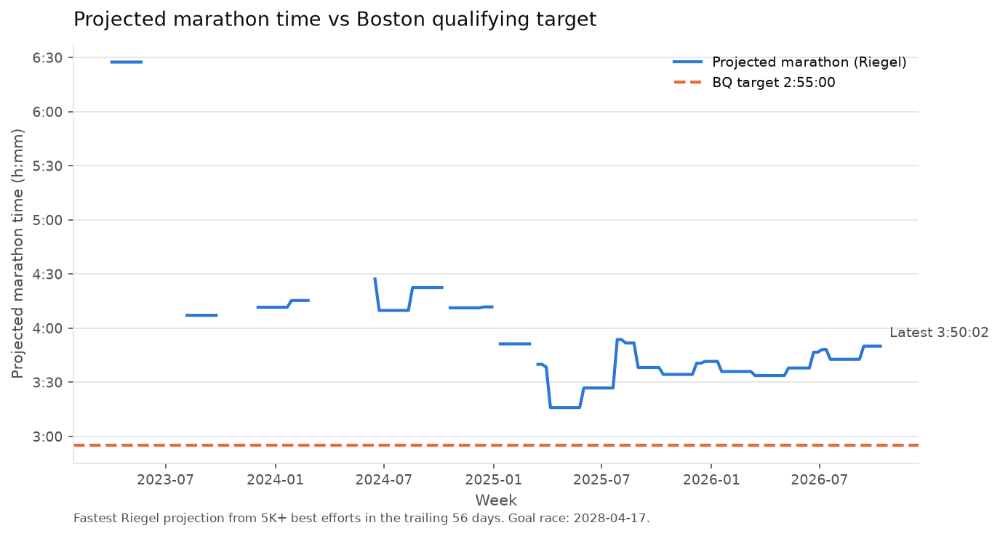
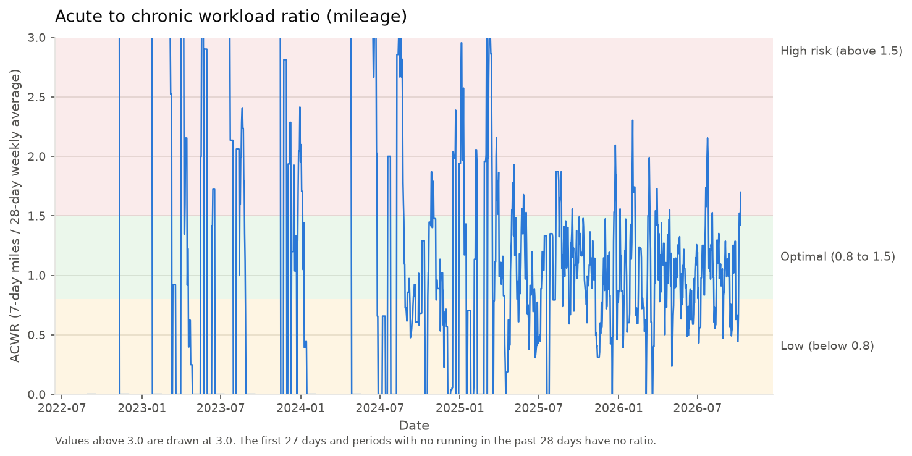
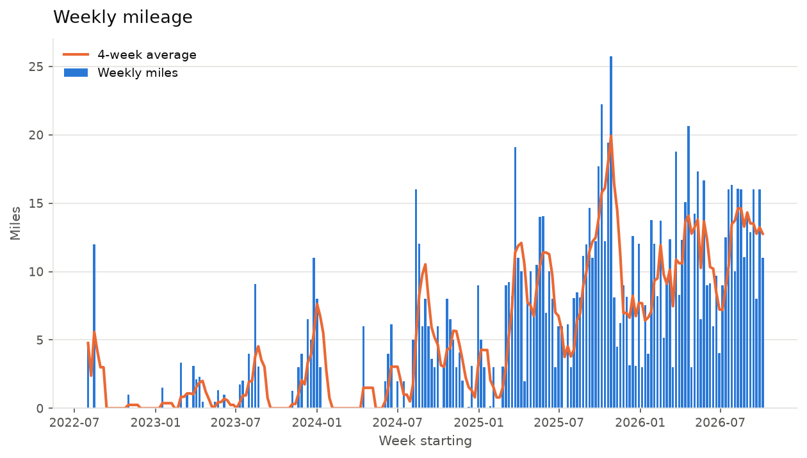
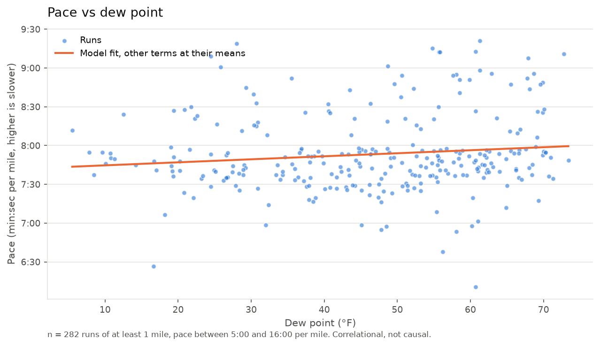

# Am I on track for the 2028 Boston Marathon?

An end-to-end analytics pipeline on my own Strava running data: extract from the Strava API, load into PostgreSQL, enrich with historical weather, and analyze with SQL views and Python.

## The question

Boston is one of the few marathons you have to qualify for. My goal is to run it in April 2028, which means running a qualifying time first. I want an honest, data-driven answer to three questions:

1. **Marathon prediction:** what marathon time does my current fitness project to, and how far is that from the qualifying standard?
2. **Training load:** am I building mileage safely, or ramping up in ways that raise injury risk?
3. **Weather impact:** how much do temperature, humidity, and wind actually slow me down?

The data is 340 runs recorded between August 2022 and October 2026, about 1,124 miles in total. Figures below reflect data through 2026-10-08.

## Architecture

```
Strava API ──> extract.py ──> data/raw/*.json
                                   │
                                   v
                              load.py ──> PostgreSQL (Supabase)
                                              │   activities, splits, best_efforts
Open-Meteo archive ──> weather.py ────────────┤   weather
                                              v
                                       sql/views.sql
                              v_runs, v_daily_load, v_acwr, v_weekly_mileage
                                              │
                                              v
                    analysis/marathon.py, training_load.py, weather_impact.py
                                              │
                                              v
                                outputs/charts, outputs/tables
```

| Step | Script | What it does |
|---|---|---|
| Extract | `extract.py` | Pulls every activity summary and the full detail of every run. Resumable, and respects Strava's rate limits (100 requests per 15 minutes, 1,000 per day). |
| Load | `load.py` | Creates the schema and upserts runs, per-mile splits, and best efforts. Rows are only rewritten when their values change, so a rerun reports 0 changes. |
| Enrich | `weather.py` | Looks up the weather at each run's start location for the hour nearest the run's midpoint. Responses are cached, so reruns make no API calls. |
| Analyze | `analysis/*.py` | SQL views do the aggregation; Python does the modeling and charts. |

`run_pipeline.py` runs every step in order.

## Key findings

### 1. Marathon prediction: about 55 minutes off the target



Each week, I take my best efforts of 5K or longer from the trailing 56 days and project them to the marathon distance with Riegel's formula, `T2 = T1 * (D2 / D1) ^ 1.06`. The weekly prediction is the fastest projection.

- **Current projection: 3:50:02**, from a recent 23:59 5K. That is **55 minutes slower** than the 2:55:00 target.
- **Best projection: 3:15:59**, from a 20:26 5K in March 2025.
- The trend improved from over 4 hours in 2023 and 2024 to the 3:30 to 3:50 range since 2025, but it has drifted slower through 2026.
- Gaps in the line are weeks with no 5K-or-longer effort in the window.

Riegel tends to be **optimistic** for runners with low weekly mileage, because it assumes the endurance to hold pace over the longer distance. My recent mileage is about 13 miles per week, well below typical marathon training, so the real gap is probably larger than shown. Best efforts are also derived from phone GPS and carry measurement error.

### 2. Training load: stop-start, but steadier since mid-2025



The acute to chronic workload ratio (ACWR) compares the last 7 days of mileage to the average weekly mileage over the last 28 days. Above 1.5 is a common injury-risk flag; below 0.8 suggests detraining.

| Risk band | Days | Share |
|---|---|---|
| Low (below 0.8) | 540 | 43.6% |
| Optimal (0.8 to 1.5) | 421 | 34.0% |
| High (above 1.5) | 277 | 22.4% |

- Through 2024, training was stop-start: breaks pushed the ratio to zero, then each return spiked it far into the high band.
- Since mid-2025 the ratio sits mostly in the optimal band, with occasional spikes.
- **54 of 219 weeks** increased mileage by more than 10% over the previous week. Many of these come from very small bases (for example 0.1 to 3.1 miles), so the percentage overstates the risk.
- As of 2026-10-08 the ratio is 1.70, in the high band.



Weekly mileage peaked at about 26 miles in late 2025 and has averaged about 13 to 15 miles per week since mid-2026.

### 3. Weather impact: no measurable effect at this sample size



An OLS regression of pace on weather, controlling for run distance and a fitness trend:

```
pace_s_per_mile ~ temperature_f + dew_point_f + wind_speed_mph + miles + days_since_first_run
```

282 runs, R² = 0.16. Runs under 1 mile and paces outside 5:00 to 16:00 per mile are excluded as likely GPS errors.

| Term | Effect on pace | 95% CI | p |
|---|---|---|---|
| Dew point, per 10°F | +2.3 s/mile | -1.9 to +6.6 | 0.28 |
| Temperature, per 10°F | -0.2 s/mile | -4.3 to +3.9 | 0.94 |
| Wind, per 5 mph | -2.9 s/mile | -7.8 to +2.0 | 0.24 |
| Distance, per mile | +2.4 s/mile | +0.3 to +4.5 | 0.03 |
| Training history, per year | -17.5 s/mile | -22.6 to -12.4 | < 0.001 |

- **None of the weather terms is statistically distinguishable from zero.** The dew point estimate points the expected way (more humid, slower), but the confidence interval includes no effect.
- Temperature and dew point are strongly correlated (r = 0.87), which makes their separate effects hard to estimate.
- The clearest signal is fitness: holding weather and distance constant, I have gotten about 17.5 seconds per mile faster per year.

Full model output: [outputs/tables/weather_regression.txt](outputs/tables/weather_regression.txt).

### So, am I on track?

Not yet. My current fitness projects to a marathon about 55 minutes slower than the qualifying standard, and the projection is probably optimistic given my mileage. Pace is improving year over year, and training has become more consistent since 2025, but closing the gap by early 2028 will take a substantial, gradual increase in weekly mileage, while keeping the workload ratio out of the high band.

## Limitations

- **Phone-only data.** Every run was recorded on a phone, not a GPS watch.
- **No heart rate.** There is no heart rate data, so there is no effort-based or physiological analysis. Pace is the only measure of intensity.
- **GPS noise.** Phone GPS makes individual splits jumpy, so all analyses use per-run, weekly, or rolling aggregates. Best efforts are GPS-derived and carry error.
- **Unreliable elevation.** Phone elevation is not accurate enough to adjust pace for hills, so hills are not accounted for.
- **Riegel assumptions.** The formula assumes marathon-level endurance and tends to be optimistic at low mileage. It also projects from short efforts (mostly 5K), which extrapolate furthest.
- **The regression is correlational.** It shows associations, not causes. Runs are not randomly assigned to weather: I may run slower on purpose in heat, or pick different routes by season.
- **Sample size and independence.** 282 runs is small for separating correlated weather variables. Residuals are autocorrelated (Durbin-Watson 0.77), so the standard errors are likely understated, and the true uncertainty is wider than shown.
- **Missing weather.** 45 runs have no GPS coordinates, and runs from the last 7 days are skipped until the weather archive covers them.
- **Qualifying standard.** The 2:55:00 target is the Boston Athletic Association standard for men aged 18 to 34 as I understand it. It must be verified against the current BAA standards and the age group I will be in on race day.

## Setup

Requirements: Python 3, a Strava account, and a PostgreSQL database (this project uses a free Supabase project).

1. **Install dependencies**
   ```
   python -m venv .venv
   source .venv/bin/activate
   pip install -r requirements.txt
   ```
2. **Create a Strava API application** at https://www.strava.com/settings/api, with `localhost` as the authorization callback domain.
3. **Configure `.env`**: copy `.env.example` to `.env` and fill in:
   - `STRAVA_CLIENT_ID` and `STRAVA_CLIENT_SECRET` from your Strava API application
   - `DATABASE_URL`: in Supabase, click **Connect** and copy the **Session pooler** connection string, replacing `[YOUR-PASSWORD]` (brackets included) with your database password
4. **Authorize once**: `python auth.py` opens a browser, asks for read access to your activities, and saves `token.json`.
5. **Run the pipeline**: `python run_pipeline.py`

The first extract can take a while: each run needs its own API request, and the client pauses whenever it nears Strava's 15-minute limit. If the daily limit is reached, rerun the next day and it resumes where it stopped.

Individual steps can also be run on their own from the repository root, for example `python load.py` or `python -m analysis.marathon`. `python transform.py` writes a flat local CSV of all runs to `data/runs.csv` for quick exploration.

Settings such as the qualifying target, goal race date, prediction window, and ACWR thresholds are in `config.py`.

## Privacy

GPS coordinates, route maps, and polylines exist only in the local raw data and the database. No committed file contains them. `.env`, `token.json`, and `data/` are never committed.
